# FPGA_Spartan6


### HELP
https://numato.com/docs/mimas-spartan-6-fpga-development-board/
https://numato.com/product/mimas-spartan-6-fpga-development-board/


https://numato.com/product-category/fpga-accelerated-computing/expansion-modules/


**1.Introduction**


<p align="center">
  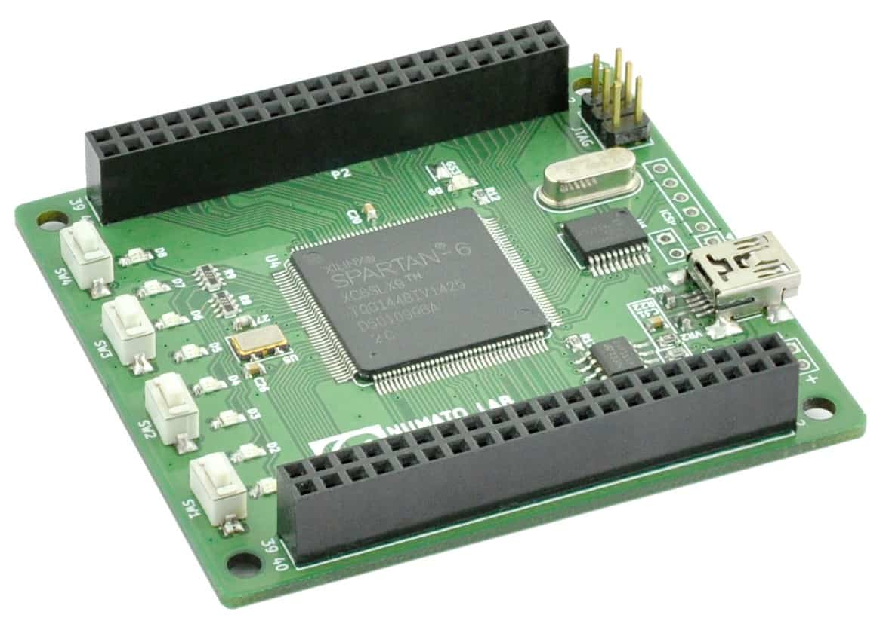
</p>


Mimas is an easy to use FPGA Development board featuring Xilinx Spartan-6 FPGA. Mimas is specially designed for experimenting and learning system design with FPGAs. This development board features Xilinx XC6SLX9 TQG144 FPGA with a maximum of 70 user IOs. The USB 2.0 interface provides fast and easy configuration download to the on-board SPI flash. You don’t need a programmer or special downloader cable to download the bitstream to the board.


**Applications**

 - Product Prototype Development
 - Home Networking
 - Signal Processing
 - Wired and Wireless Communications
 - Educational tool for schools and universities


**Board features**

 - FPGA: Spartan-6 XC6SLX9 in TQG144 package
 - Flash memory: 16 Mb SPI flash memory (M25P16)
 - 100MHz CMOS oscillator
 - USB 2.0 interface for On-board flash programming
 - FPGA configuration via JTAG and USB
 - 8 LEDs and four switches for user-defined purposes
 - 70 IOs for user-defined purposes
 - On-board voltage regulators for single power rail operation


**Components/Tools Required**

Along with the module, you may need the items in the list below for easy and fast installation.

1. USB A to Mini B cable.
2. DC Power supply (Optional).


**Connection Diagram**


<p align="center">
  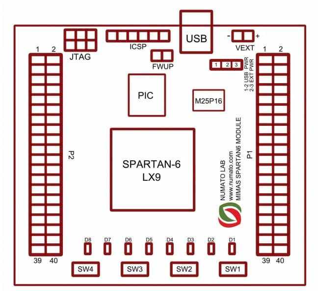
</p>


**USB Interface**


<p align="center">
  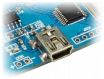
</p>


**DC Power Supply**

<p align="center">
  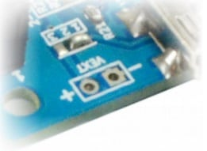
</p>


**On-Board Peripherals**

8 LEDs and four micro switches are provided on-board for user-defined purposes. These peripherals are connected to FPGA IOs and can be controlled from user RTL. The switches do not have pull-ups on board so make sure to enable week pull-ups on corresponding IOs in your design.


**JTAG Connector**


A JTAG connector provides access to FPGA’s JTAG pins. A Xilinx platform cable tool can be used to for JTAG programming.


<p align="center">
  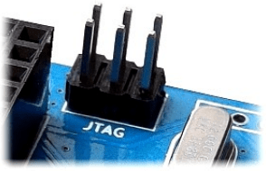
</p>


<p align="center">
  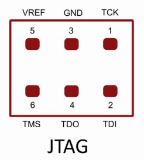
</p>


**GPIOs**


This board is equipped with 70 user IO pins that can be used for various custom applications. Pin assignments on the connectors are available in the tables below.


**HEADER P1**

| Header Pin No. | Pin description | Spartan-6 (XC6SLX9 TQG144) Pin No. |
| --- |  --- | ---  |
1 	| VCCIO| NA
2 	| GND |	NA
3	| IO_L1P_3 |	35
4 	| IO_L1N_VREF_3 |	34
5 	| IO_L2P_3 |	33
6	| IO_L2N_3 |	32
7	| IO_L36P_3 |	30
8	| IO_L36N_3 |	29
9 	| IO_L37P_3 |	27
10	| IO_L37N_3 |	26
11	| IO_L41P_GCLK27_3 |24
12	| IO_L41N_GCLK26_3 |	23
13 	| IO_L42P_GCLK25_TRDY2_3  |	22
14 	| IO_L42N_GCLK24_3 |	21
15	| IO_L43P_GCLK23_3 |	17
16	| IO_L43N_GCLK22_IRDY2_3 |	16
17	| IO_L44P_GCLK21_3 |	15
18	| IO_L44N_GCLK20_3 |	14
19	| IO_L49P_3 |	12
20	| IO_L49N_3 |	11
21	| IO_L50P_3 |	10
22	| IO_L50N_3 |	9
23	| IO_L51P_3 |	8
24	| IO_L51N_3 |	7
25 	| IO_L52P_3 |	6
26	| IO_L52N_3 |	5
27	| IO_L83P_3 |	2
28 	| IO_L83N_VREF_3 |	1
29 	| IO_L2P_0 |	142
30	| IO_L2N_0 |	141
31	| IO_L3P_0 |	140
32	| IO_L3N_0 |	139
33	| IO_L4P_0 |	138
34 	| IO_L4N_0 |	137
35 	| IO_L34P_GCLK19_0	|134
36 	| IO_L34N_GCLK18_0 |	133
37	| IO_L35P_GCLK17_0 |	132
38	| IO_L35N_GCLK16_0 |	131
39	| VCCIO |	NA
40 	| GND	| NA


**HEADER P2**


| Header Pin No. | Pin description | Spartan-6 (XC6SLX9 TQG144) Pin No. |
| --- |  --- | ---  |
1   |	GND	 |	NA
2  |	VCCIO	 |	NA
3   |	IO_L62N_D6_2	 |	43
4  |	IO_L62P_D5_2 	 |	44
5  |	IO_L49N_D4_2 	 |	45
6   |	IO_L49P_D3_2 	 |	46
7   |	IO_L48N_RDWR_B_VREF_2  |		47
8   |	IO_L48P_D7_2 	 |	48
9   |	IO_L31N_GCLK30_D15_2  |		50
10  |	IO_L31P_GCLK31_D14_2 	 |	51
11  |	IO_L30N_GCLK0_USERCCLK_2 	 |	55
12  |	IO_L30P_GCLK1_D13_2  |		56
13  |	IO_L74N_DOUT_BUSY_1  |		74
14   |	IO_L74P_AWAKE_1  |		75
15  |	IO_L47N_1  |		78
16  |	IO_L47P_1  |		79
17   |	IO_L46N_1  |		80
18   |	IO_L46P_1  |		81
19   |	GND  |		NA
20   |	GND  |		NA
21   |	IO_L45N_1  |		82
22   |	IO_L45P_1  |		83
23  |	IO_L43N_GCLK4_1   |		84
24  |	IO_L43P_GCLK5_1   |		85
25   |	IO_L42N_GCLK6_TRDY1_1 |		87
26  |	IO_L42P_GCLK7_1  |		88
27   |	IO_L41N_GCLK8_1  |		92
28   |	IO_L41P_GCLK9_IRDY1_1	 |	93
29   |	IO_L40N_GCLK10_1  |		94
30   |	IO_L40P_GCLK11_1  |		95
31   |	IO_L34N_1  |		97
32  |	IO_L34P_1  |		98
33   |	IO_L33N_1  |		99
34  |	IO_L33P_1  |		100
35  |	IO_L32N_1  |		101
36  |	IO_L32P_1  |		102
37  |	IO_L1N_VREF_1  |	 	104
38   |	IO_L1P_1 	 |	105
39  |	GND	 |	NA
40  |	VCCIO |		NA


**Driver Installation**

To use this product with Linux, the USB CDC driver needs to be compiled in with the kernel. Fortunately, most Linux distributions (Ubuntu, Redhat, Debian, etc..) have this driver pre-installed. The chances of you requiring to rebuild the kernel to include the USB CDC driver is very slim. When connected to a Linux machine, this product should appear as a serial port in the /dev directory. Usually, the name of the device will be “ttyACMx” or similar. The name may be different depending on the Linux distribution you have.


Download link

https://www.xilinx.com/support/download/index.html/content/xilinx/en/downloadNav/vivado-design-tools/archive-ise.html


Full Installer for Linux (TAR/GZIP - 6.09 GB)

MD5 SUM Value : e8065b2ffb411bb74ae32efa475f9817

https://amd-ax-dl.entitlenow.com/dl/ul/2013/10/18/R209855202/Xilinx_ISE_DS_Lin_14.7_1015_1.tar?hash=msGZ-0ybZTgtZTAXv7NdRQ&expires=1733594916&filename=Xilinx_ISE_DS_Lin_14.7_1015_1.tar


Select Products to Install

ISE WebPACK


Dir  --> /home/sab/Xilinx


OUT:


```
The environment variables are written to settings[32|64].(c)sh at "/home/sab/Xilinx/14.7/ISE_DS". To launch the Xilinx tools, first source the settings script:

C-shell 64 bit environment...
source /home/sab/Xilinx/14.7/ISE_DS/settings64.csh

Shell, Bash shell, Korn Shell 64 bit environment...
. /home/sab/Xilinx/14.7/ISE_DS/settings64.sh

C-shell 32 bit environment...
source /home/sab/Xilinx/14.7/ISE_DS/settings32.csh

Shell, Bash shell, Korn Shell 32 bit environment...
. /home/sab/Xilinx/14.7/ISE_DS/settings32.sh

```


run the command
```
. settings64.sh 
```


```
sab@SH4D0W6:~/Xilinx/14.7/ISE_DS$ . settings64.sh 
. /home/sab/Xilinx/14.7/ISE_DS/common/.settings64.sh /home/sab/Xilinx/14.7/ISE_DS/common
. /home/sab/Xilinx/14.7/ISE_DS/EDK/.settings64.sh /home/sab/Xilinx/14.7/ISE_DS/EDK
. /home/sab/Xilinx/14.7/ISE_DS/PlanAhead/.settings64.sh /home/sab/Xilinx/14.7/ISE_DS/PlanAhead
. /home/sab/Xilinx/14.7/ISE_DS/ISE/.settings64.sh /home/sab/Xilinx/14.7/ISE_DS/ISE

```


Launch ISE GUI

```
ise

```


For windows

libPortability.dll

libPortability.dll.orig

libPortabilityNOSH.


**Product Licensing**


https://adaptivesupport.amd.com/s/article/Xilinx-Licensing-Solution-Center?language=en_US

https://account.amd.com/en/forms/license/license-form.html


1. Product Selection

ISE WebPACK License


2. System Information
Host name : <name>
operating system : linux
eth0_mac :  0ae0afd20fa2


 - Then you get your license file via email address. 
 - Download and upload the software.


FILE : Xilinx.lic


Type this command, hit enter, and load your license file Xilinx.lic


```
xlcm -manage
```


### HELP


**Step:1**

<p align="center">
  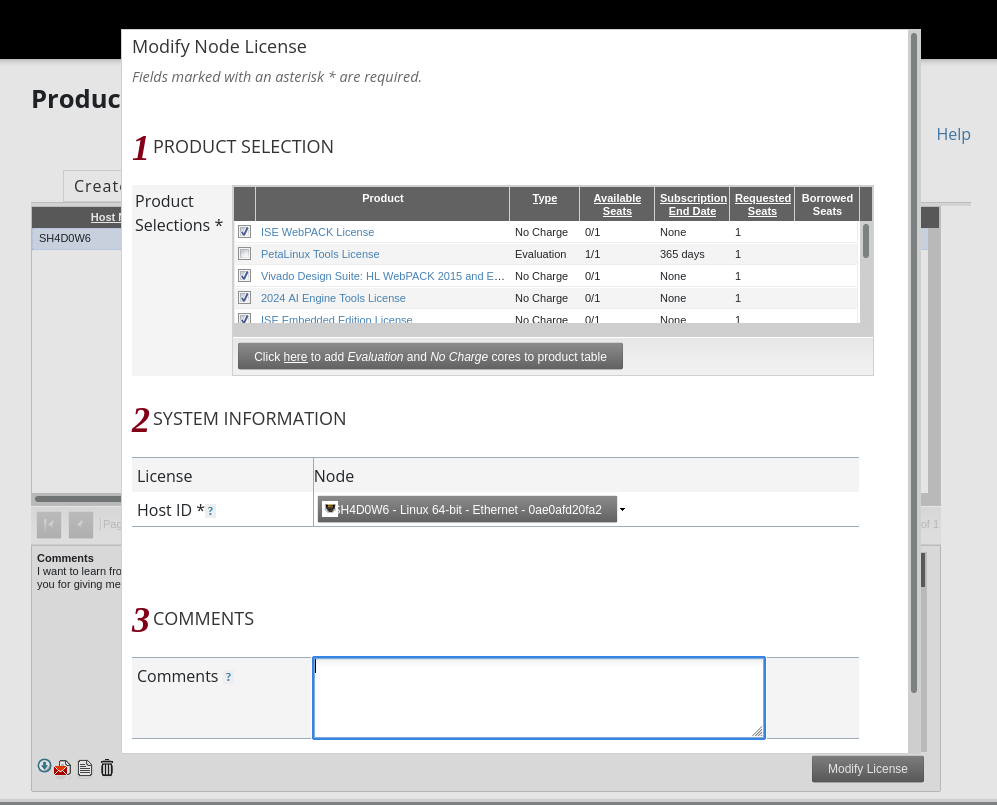
</p>

**Step:2**

<p align="center">
  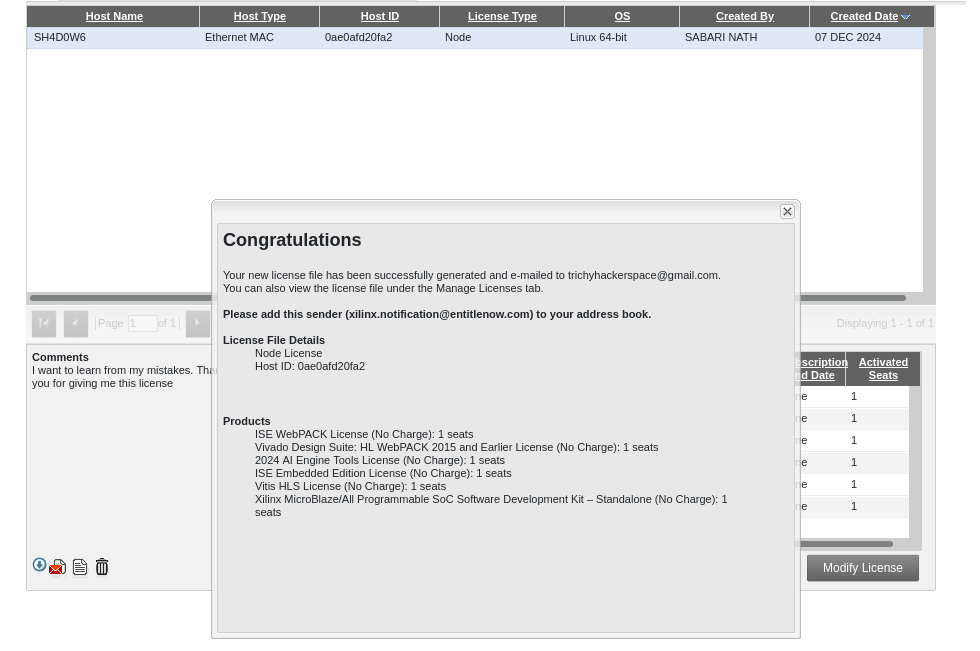
</p>

**Step:3**

<p align="center">
  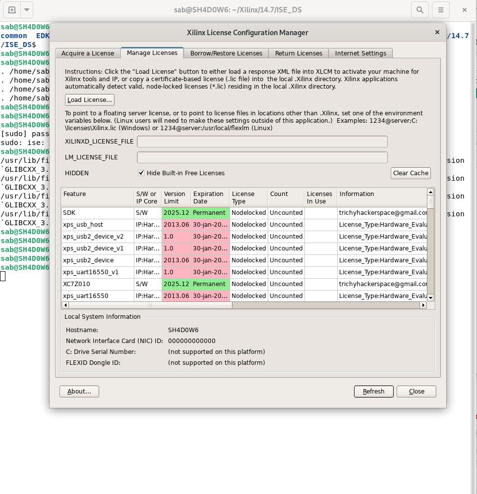
</p>


**First_Project**


**Simulation BCD to 7 Segment using Verilog on Xiling ISE**


BCD (Binary Coded Decimal)


```
https://www.youtube.com/watch?v=1mQ_YmWLsDg&ab_channel=MIFTAHSHOFFANM.
https://verilogcodes.blogspot.com/2015/10/verilog-code-for-bcd-to-7-segment.html
```

--> New Project   --> project_name  --> source_type [HDL]


Board_info  :
    Family  : Spartan6
    Device  : XC6SLX9
    PACKGAE : TQG144
    Flash memory: 16 Mb SPI flash memory (M25P16)
    100MHz CMOS oscillator
    USB 2.0 interface

-->  finish
                       
                       
                       
--> New Source Wizard   --> Verilog Module  --> filename : s7seg


--> paste the code


--> Goto  -->  synthesize - XST --> RUN
       --> view RTL Schematics --> Right Click --> RUN


--> New Source Wizard   --> Verilog Test Fixture  --> filename : testbench7seg
   then select the source wizard --> Next   --> Finish


--> Goto simulation  --> select testbench7seg.v
--> ISim Simulator --> Behavioral Check Syntax --> Run
      --> Simulate Behavioral Model --> Run


then right click  Float (view full screen)  (Default.wcfg)


**Project_2**

[Push Button Switch](https://github.com/numato/samplecode/tree/master/FPGA/ExpansionModules/PushButtonSwitches)
 

https://www.youtube.com/watch?v=gE1X5ZcM83I&ab_channel=KajNormanNielsen
https://www.youtube.com/watch?v=w3Vgw-RzjAA&ab_channel=AllAboutFPGA


```
https://www.youtube.com/watch?v=nC8w37BIJ74&ab_channel=AugmentedAI
```


**Flashcmd**


```
https://github.com/multigcs/riocore/blob/main/riocore/boards/Spartan6/README.md

Flashcmd: openFPGALoader -v -c usb-blaster --fpga-part xc6slx9tqg144 -f rio.bit
```


**mesa Card**

https://github.com/LinuxCNC/hostmot2-firmware/tree/master


**Samplecode**

https://github.com/numato/samplecode/tree/master/FPGA/ExpansionModules
https://github.com/Tpj-root/samplecode


| Name | Language/Technology | IDE |
| --- |  --- | ---  |
| [16x2 LCD Display](https://github.com/numato/samplecode/tree/master/FPGA/ExpansionModules/LCDDisplay16x2) |  Verilog | Xilinx ISE  |
| [LEDs](https://github.com/numato/samplecode/tree/master/FPGA/ExpansionModules/LEDExpansionModule) |  Verilog | Xilinx ISE  |
| [Push Button Switch](https://github.com/numato/samplecode/tree/master/FPGA/ExpansionModules/PushButtonSwitches) |  Verilog | Xilinx ISE  |
| [Seven Segment LED Display](https://github.com/numato/samplecode/tree/master/FPGA/ExpansionModules/SevenSegmentLEDDisplay) |  Verilog | Xilinx ISE  |
| [8Bit VGA](https://github.com/numato/samplecode/tree/master/FPGA/ExpansionModules/VGA8bit) |  Verilog | Xilinx ISE  |
| [LM4550 AC97 Audio](https://github.com/numato/samplecode/tree/master/FPGA/ExpansionModules/AC97Audio) |  Verilog | Xilinx ISE  |
| [CS4344 Stereo Audio](https://github.com/numato/samplecode/tree/master/FPGA/ExpansionModules/CS4344Audio) |  Verilog | Xilinx ISE  |


**Generating Bitstream for Mimas**

HDL design needs to be converted to a bitstream before it can be programmed to FPGA. Mimas at this time accepts only binary (.bin) bitstream created by Xilinx ISE (http://www.xilinx.com/tools/webpack.htm). Once the HDL is synthesized, it is easy to create a binary bitstream out of it. Please follow the steps below to generate a binary bitstream from your design using ISE Web Pack.


Step 1: Right-click on the “Generate Programming File” option in the “Processes” window.


<p align="center">
  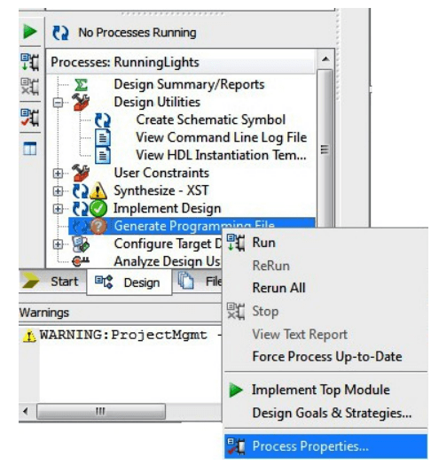
</p>


Step 2: Select “Process Properties” from the pop-up menu. In the dialog box, check the “Create Binary Configuration File” Checkbox and click “Apply”.


<p align="center">
  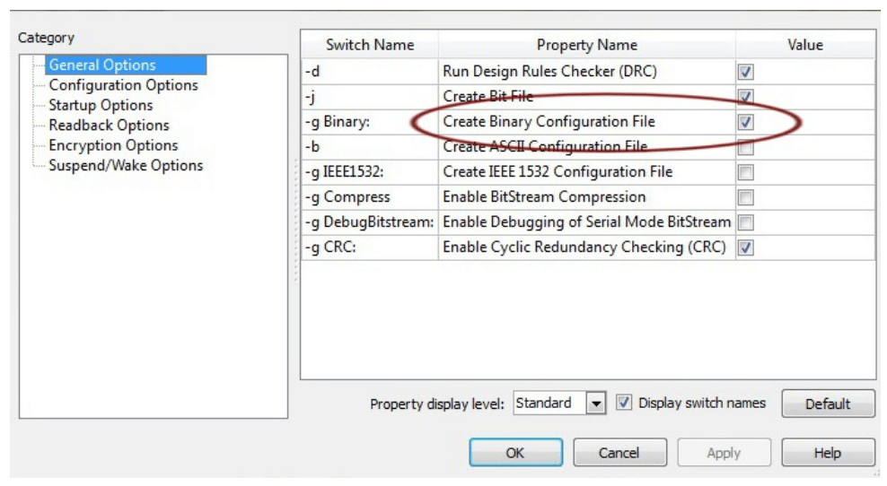
</p>


Step 3: Click “OK” to close the dialog box. Right-click on the “Generate Programming File” option again and select “Run”. Now you will be able to find a .bin file in the project directory and that file can be used for Mimas configuration.


**Mechanical Dimensions**


https://github.com/numato/samplecode/tree/master/FPGA/Mimas/board


**3D_FILE**

https://myhub.autodesk360.com/ue28a7dc2/g/shares/SHabee1QT1a327cf2b7a9ac88fac7ba751a2

<p align="center">
  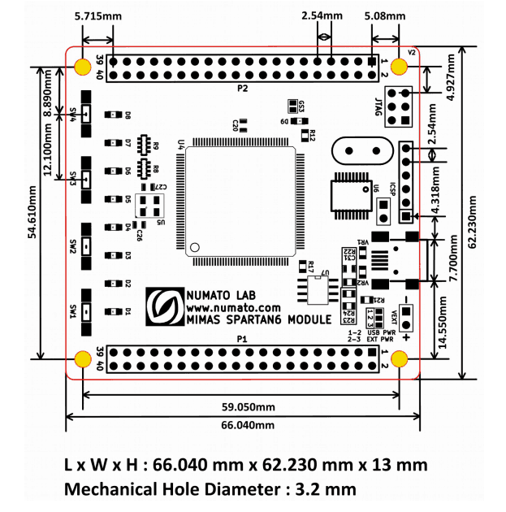
</p>


**Schematics**

[Mimas_Schematics](img/MimasSpartan6ModuleSch.pdf)


